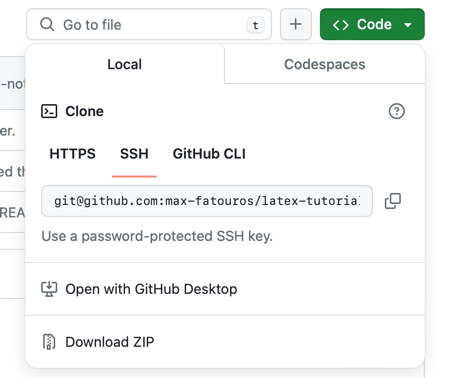
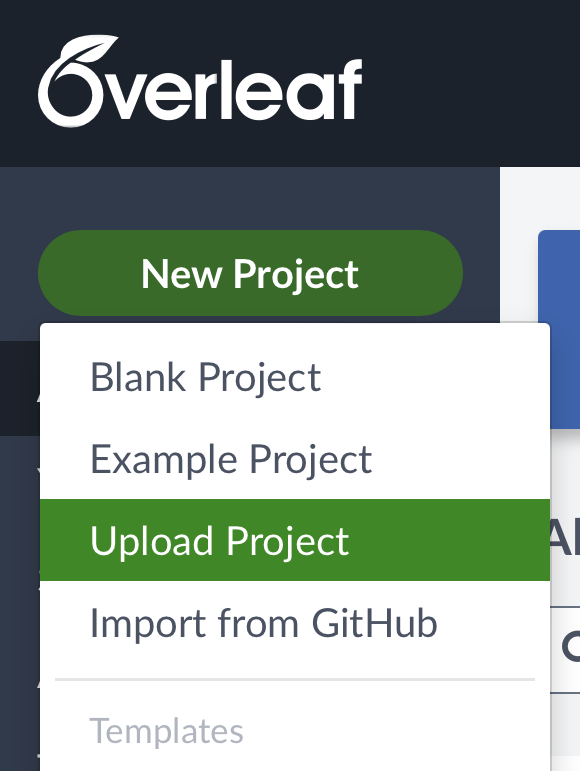

# latex-tutorial

A brief $\LaTeX$ tutorial made for the University of Manitoba Space Applications and Technology Society ([UMSATS](http://www.umsats.ca/)).

## Description
The tutorial consists of a 30 minute lecture and a fill-in-the-blank handout for students to complete.

The lecture covers the fundamentals needed to start using LaTeX, such as
* What LaTeX is.
* What [Overleaf](https://www.overleaf.com/) is.
* How a basic LaTeX document is organized (preamble, title, content).
* What the different preamble commands do (`\documentclass`, `\usepackage`, title and table of content commands).
* How to write text and lists.
* How to write math.
* How to add figures and tables.
* How to link different parts of the document with `\label` and the `hyperref` package. 

In the handout, the students are given a chance to try these basic commands and ask questions as they go.

## Getting Started
1. Clone or download this entire GitHub repository to your computer. The easiest way to do this is do click on the green `<> Code ▼` dropdown-list button and select the `download ZIP` option.



2. Go to [Overleaf](https://www.overleaf.com/).
   1. Log in or create an account.
   2. From the `New Project` dropdown, select `Upload project`.
   3. Upload the zip file. (Or, if your browser auto-unzipped the github repository to a folder, click `Blank Project` and upload the entire folder to that blank project).



3. In the now opened overleaf project, you should have a file explorer on the left-hand side with files and folders shown below. To compile a tex file, click on one of the `main.tex` files and hit compile or <ctrl+enter>.

```bash
├── README.md
├── github.png
├── handout
│   ├── kitten.png
│   └── main.tex  <--
├── lecture-notes
│   ├── kitten.png
│   └── main.tex  <--
└── overleaf.png
```

4. Compile the `main.tex` in the `lecture-notes` directory. Read the compiled pdf and then the source-code of that `main.tex`.
5. Compile the `main.tex` in the `handout` directory. Read the compiled pdf and fill-out the source-code of that `main.tex` as you go.